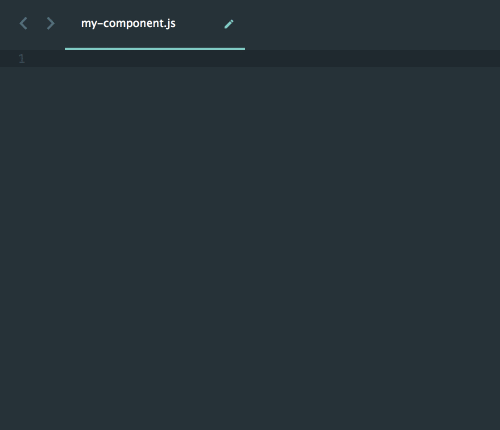
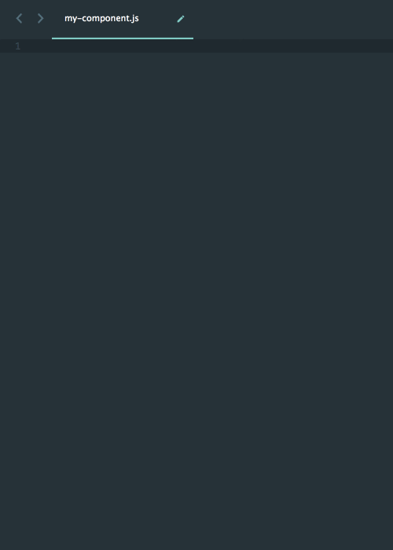

# React Development Snippets

Feeling bored with typing or even copying React codes to write React components and test cases? If you use Sublime, hope these code snippets can help you enjoy writing your React components.

The snippets follow JavaScript ES6 syntax, we don't use the old `React.createClass({...})` anymore, we write class component and functional component. Also we provide snippets to quickly write React Lifecycle functions (e.g. `componentDidMount`).

**Latest Updates (June 27, 2016)**
 * Added to [Package Control](https://packagecontrol.io/packages/React%20ES6%20Snippets)! Thank you so much [FichteFoll](https://github.com/FichteFoll)!
 * Fix **Component Will Mount** snippet command

**Updates (June 14, 2016)**
 * Rename our project to **React Development Snippets**

**Updates (May 22, 2016)**
 * Reorganized folder structure and grouped snippets to: React, Redux and Test
 * Added Redux related snippets to help you write actions, reducers and redux components faster
 * Added `<FormattedMessage />` snippet

## Snippets ##

### React ###

**ES6 Class Component** `rcc + <TAB>`<br />
<br />
```javascript
import React, { Component, PropTypes } from 'react';

class ${1:Component} extends Component {
    static propTypes = {
        className: PropTypes.string,
    };

    constructor(props) {
        super(props);
    }

    render() {
        return (
            ${0}
        );
    }
}

export default ${1:Component};
```

**ES6 Class Component with injectIntl** `rcci + <TAB>`
```javascript
import React, { Component, PropTypes } from 'react';
import { injectIntl, intlShape } from 'react-intl';

class ${1:Component} extends Component {
    static propTypes = {
        intl: intlShape.isRequired,
    };

    constructor(props) {
        super(props);
    }

    render() {
        const { formatMessage } = this.props.intl;

        return (
            ${0}
        );
    }
}

export default injectIntl(${1:Component});
```

**Functional Component** `rfc + <TAB>`<br />
<br />
```javascript
import React, { PropTypes } from 'react';

const ${1:Component} = ({
    className = '',
}) => {
    return (
        <div>
            ${0}
        </div>
    );
};

${1:Component}.displayName = '${1:Component}';

${1:Component}.propTypes = {
    className: PropTypes.string,
};

export default ${1:Component};
```

**Functional Component with injectIntl** `rfci + <TAB>`
```javascript
import React, { PropTypes } from 'react';
import { injectIntl, intlShape } from 'react-intl';

const ${1:Component} = ({
    intl,
}) => {
    const { formatMessage } = intl;

    return (
        ${0}
    );
};

${1:Component}.displayName = '${1:Component}';

${1:Component}.propTypes = {
    intl: intlShape.isRequired,
};

export { ${1:Component} };

export default injectIntl(${1:Component});
```

**static propTypes** `rspt + <TAB>`
```javascript
static propTypes = {
    ${1:prop}: PropTypes.${2:string},
};
```

**static defaultProps** `rdp + <TAB>`
```javascript
static defaultProps = {
    ${1:prop}: ${2:value},
};
```

**Define Formatted Messages** `rdm + <TAB>`
```javascript
const messages = defineMessages({
    ${1:message}: {
        defaultMessage: '${2:default message}',
        description: '${3:description}',
        id: '${4:id}',
    },
});
```

**Define New Formatted Message** `rnm + <TAB>`
```javascript
${1:message}: {
    defaultMessage: '${2:default message}',
    description: '${3:description}',
    id: '${4:id}',
},
```

**componentDidMount()** `rcdm + <TAB>`
```javascript
componentDidMount() {
    ${1}
}
```

**componentDidUpdate(prevProps, prevState)** `rdu + <TAB>`
```javascript
componentDidUpdate(prevProps, prevState) {
    ${1}
}
```

**componentWillMount** `rcwm + <TAB>`
```javascript
componentWillMount() {
    ${1}
}
```

**componentWillReceiveProps(nextProps)** `rcwrp + <TAB>`
```javascript
componentWillReceiveProps(nextProps) {
    ${1}
}
```

**componentWillUnmount()** `rcwum + <TAB>`
```javascript
componentWillUnmount() {
    ${1}
}
```

**componentWillUpdate(nextProps, nextState)** `rcwu + <TAB>`
```javascript
componentWillUpdate(nextProps, nextState) {
    ${1}
}
```

**shouldComponentUpdate(nextProps, nextState)** `rscu + <TAB>`
```javascript
shouldComponentUpdate(nextProps, nextState) {
    return ${1};
}
```

### Redux ###
**Redux Component** `rrc + <TAB>`<br />
<br />
```javascript
import React, { Component, PropTypes } from 'react';
import { connect } from 'react-redux';
import {
    ${2:action} as ${2:action}Action,
} from '${3:path}';

const mapDispatchToProps = (dispatch) => {
    return {
        ${2:action}: () => {
            dispatch(${2:action}Action());
        },
    };
};

const mapStateToProps = ({ state }) => ({
    ${4:prop}: state.${4:prop}
});

export class ${1:Component} extends Component {
    render() {
        const {
            ${2:action}
        } = this.props;

        return (
            ${0}
        );
    }
}

export default connect(
    mapStateToProps,
    mapDispatchToProps
)(${1:Component});
```

**Redux Action** `rra + <TAB>`
```javascript
export const ${1:action} = (${2:payload}) => ({
    type: ${3:type},
    ${2:payload}
});
```

**Reducer** `rrr + <TAB>`
```javascript
import {
    ${2:Action}
} from '${3:path}';

const defaultState = {
    ${4:prop},
};

const ${1:Reducer} = (state = defaultState, action = {}) => {
    switch (action.type) {
        case ${5:type}:
            return {
                ...state,
            };

        default:
            return state;
    }
};

export default ${1:Reducer};
```

### Test ###
**React Test Case (chai assert and enzyme)** `rt + <TAB>`<br/>
<br />
```javascript
import React from 'react';
import { assert } from 'chai';
import { shallow } from 'enzyme';
import ${1:Component} from '${2:../component}';

const sandbox = sinon.sandbox.create();

describe('${1:Component}', () => {
    afterEach(() => {
        sandbox.verifyAndRestore();
    });

    beforeEach(() => {
        ${3}
    });

    it('should render ${1:Component} correctly', () => {
        const component = shallow(
            <${1:Component} />
        );
        ${4}
    });
});
```

**React Test Describe** `rtd + <TAB>`
```javascript
describe('${1:...}', () => {
    afterEach(() => {
        ${2}
    });

    beforeEach(() => {
        ${3}
    });

    it('should ${4:...}', () => {
        ${0}
    });
});
```

**React Test it()** `rti + <TAB>`
```javascript
it('should ${1:...}', () => {
    ${0}
});
```

**import** `rim + <TAB>`
```javascript
import ${1:Package} from '${2:path}';
```

## Installation ##

### Use Package Control ###

 * Make sure you have [Package Manager](https://packagecontrol.io/installation) installed
 * Launch the command palette: `⌘+shift+p` on MacOS, `ctrl+shift+p` on Windows
 * Type `install`, select `Package Control: Install Package`
 * Type `React`, select `React Development Snippets`

### Without Package Control ###

Navigate to your Sublime Text packages folder and git clone our project.

#### MacOS ####
"/Users/{user}/Library/Application Support/Sublime Text {2|3}/Packages"

#### Windows ####
"C:\Users\{user}\AppData\Roaming\Sublime Text {2|3}\Packages"

```
git clone https://github.com/jeantimex/react-sublime-snippet.git "React-Development-Snippets"
```

## Authors

* **Yong Su** - *Box Inc.* - [jeantimex](https://github.com/jeantimex)

## License

This project is licensed under the MIT License.
