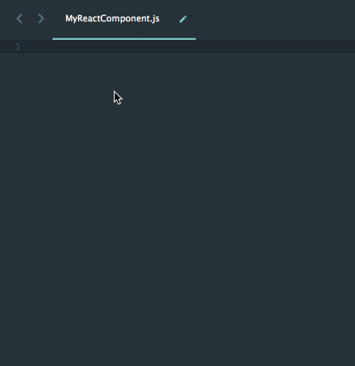
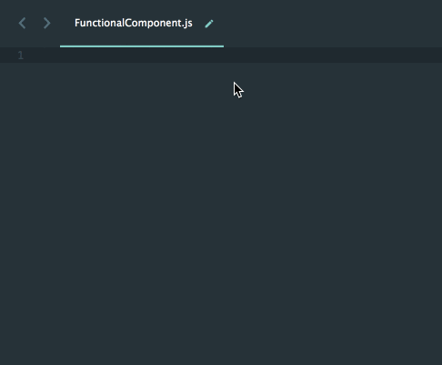
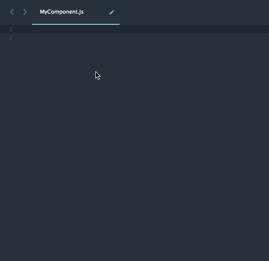
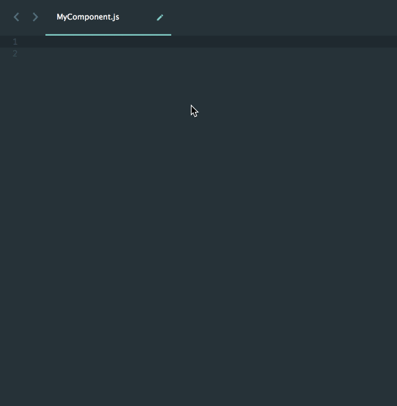
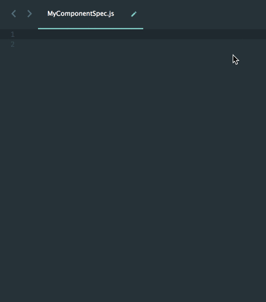

# React Sublime Snippet

Feeling bored with typing or even copying React codes to write React components and test cases? If you use Sublime, hope these code snippets can help you a little bit.

###Usage

1. Generate code snippet for React component (ES6 syntax): `rcomponent<TAB>`
 

2. Generate code snippet for functional React component: `rcomp<TAB>`
 

3. Generate code snippet for React component (with injectIntl): `rcomponentintl<TAB>`
 

4. Generate code snippet for functional React component (with injectIntl): `rcompintl<TAB>`
 

5. Generate code snippet for React test case (with enzyme and chai assert): `rtest<TAB>`
 

6. Generate code snippet for React test case `describe` statement: `rdesc<TAB>`
7. Generate code snippet for React test case `it` statement: `rit<TAB>`

###How to Install
Put the *.sublime-snippet files to your sublime Packages\User folder.
